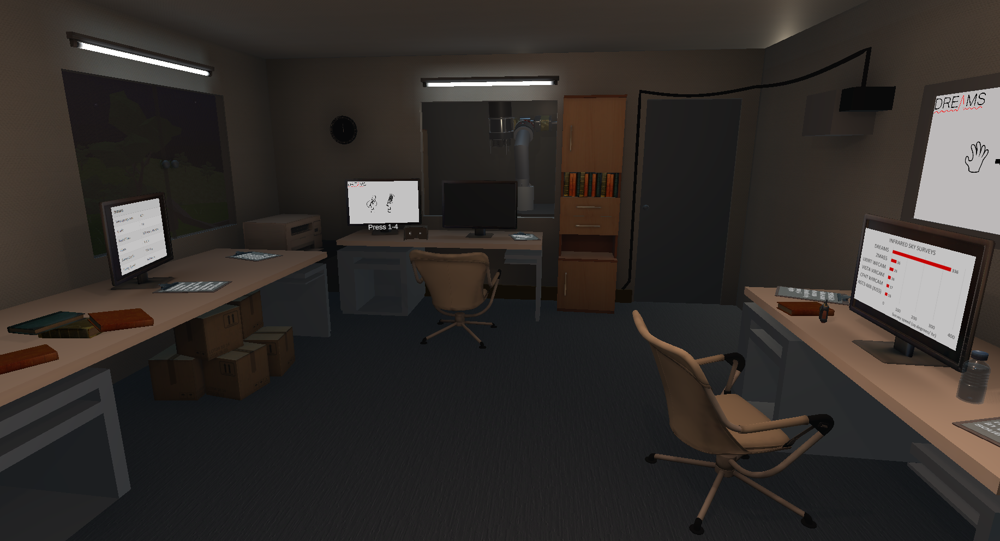
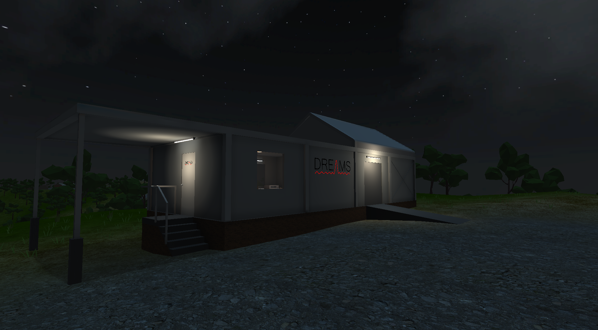
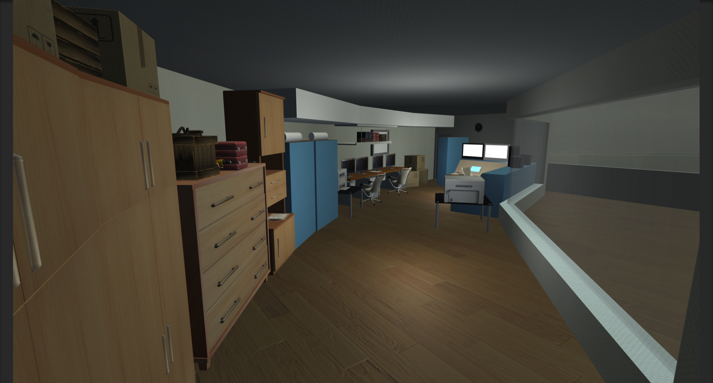
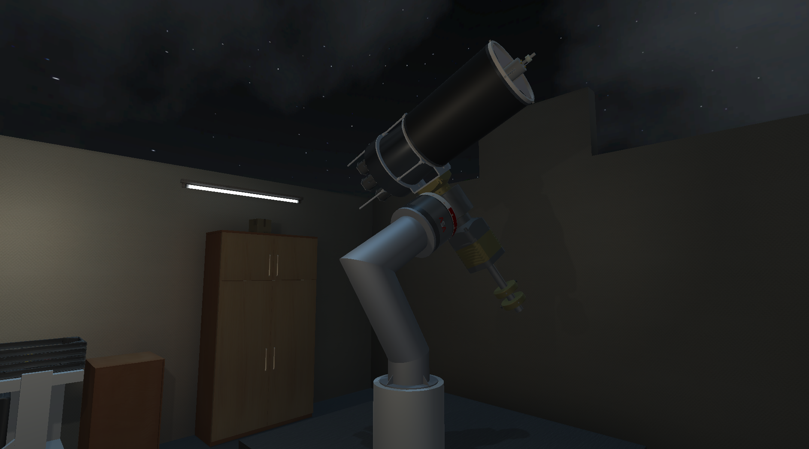
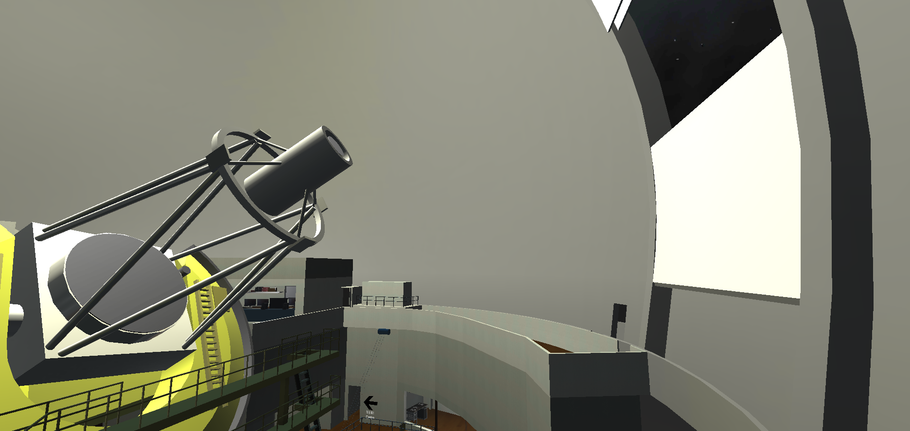

<!-- PROJECT SHIELDS -->
[![Release][release-shield]][release-url]
[![Last Commit][last-commit-shield]][last-commit-url]
[![Contributors][contributors-shield]][contributors-url]
[![Forks][forks-shield]][forks-url]
[![Issues][issues-shield]][issues-url]

<!-- PROJECT LOGO -->
 

  

  <h2 align="center">Siding Spring Observatory Experience | ANU TechLauncher</h2>

  

    A rendition of several different telescopes located at the Siding Spring Observatory NSW.
     
    <a href="https://sites.google.com/view/2021-s2-techlauncher-dreams/home"><strong>Visit the website »</strong></a>
     
    <a href="https://github.com/VR-Observatory/SidingSpringObservatory/releases">Download the App</a>
  

<!-- TABLE OF CONTENTS -->

  
Table of Contents

  <ol>
    <li><a href="#about-the-project">About The Project</a></li>
    <li><a href="#links">Links</a></li>
    <li><a href="#project-details">Project Details</a></li>
    <li><a href="#background-info">Background Info</a></li>
    <li><a href="#unity-project-structure">Unity Project Structure</a></li>
    <li><a href="#contact">Contact</a></li>
    <li><a href="#acknowledgements">Acknowledgements</a></li>
  </ol>

## About The Project

 

Our project aims to create a virtual experience where users can interact with a rendition of several different telescopes located at the Siding Spring Observatory NSW. Users will be able to view and operate a simulated version of these telescopes, and explore the surrounding facility.

The main purpose of our project is for education and outreach. It will be valuable for anyone looking to learn about astronomy, or engineers to examine the operation and installation of these telescopes.

The experience is built for the Oculus Quest 2 virtual reality (VR) headset, but there is also a standalone version for PC with support for keyboard or gamepad controls. Additionally, we have ported the application to Android mobile devices.

## Links
[Project Landing Page - Information About our Project](https://sites.google.com/view/2021-s2-techlauncher-dreams/home)

[Google Drive - Documentation & Assets](https://drive.google.com/drive/folders/1rxuu53fC7sdDQ-8IuXaFRbKkWeSXq4gD?usp=sharing)

[Trello - Kanban Style Development Board](https://trello.com/b/t7usLZgQ/vr-dreams-telescope)

## Project Details

Our project aims to create a virtual rendition of several telescopes all located at Siding Spring Observatory NSW. Last semester we brought the DREAMS telescopes (the namesake of our project) to the experience. This semester we expanded the project to include an additional telescope from Siding Spring: the Anglo-Australian Telescope, which is the largest telescope in Australia.

With the use of the Unity3D game engine, we implemented interaction with the scene, allowing users to control telescopes and explore different observatories. Users can also open and close the roof to observe the sky, and adjust the time of day. Facts about each telescope and infographics are placed around the scene, in addition to tutorials to ensure the experience is accessible to anyone. This semester, we also improved usability and polish. Notably, the environment was improved, a teleport function was added to transport players between telescopes, and advanced menu features were added for virtual reality (VR).

The experience is available on three different platforms. First, we are able to maintain an average of 50-60 frames per second for the Oculus Quest 2, which uses mobile processors running an Android-based operating system. The experience also has a standalone Windows PC desktop version, with support for keyboard or gamepad. The desktop version also dynamically detects any connected Oculus device, including Oculus Rift. We also ported the experience to Android mobile devices, adapting the application to use touch screen controls.
   
Our project will be valuable to educational institutions, engineers and researchers interested in astronomy. The VR experience and mobile port will assist with outreach and public relations for the observatory, given the portable nature of the Oculus Quest device.

## Background Info

### Siding Spring Observatory
Siding Spring Observatory (SSO), on the edge of the Warrumbungle National Park near Coonabarabran, NSW, is Australia's premier optical and infrared astronomical observatory. The ANU’s Research School of Astronomy and Astrophysics (RSAA) operates its research telescopes, and hosts those of other institutions.
<a href="https://rsaa.anu.edu.au/observatories/siding-spring-observatory/about">Click here to read more</a>

### DREAMS

The Dynamic REd All-sky Monitoring Survey (DREAMS) Telescope is an automated sky-scanning infrared telescope. The telescope is currently under construction, and will be installed at Siding Spring Observatory. This was the first telescope added to our project in 2021 S1, and our project is named after it.
<a href="https://dreams.anu.edu.au/">Click here to read more</a>

### Anglo-Australian Telescope

The Anglo-Australian Telescope (AAT) is an equatorially-mounted telescope and, with a 3.9m-diameter mirror, is the largest optical telescope in Australia. It is equipped with a robotic spectrograph it can simultaneously observe hundreds of galaxies and stars. It has also been used to carry out several important southern sky surveys, including the 2-degree-field Galaxy Redshift Survey (2dfGRS), and plays an important role in the search for planets around other stars. This was the second telescope added to our project.
<a href="https://rsaa.anu.edu.au/observatories/telescopes/anglo-australian-telescope">Click here to read more</a>

### ANU 2.3m Telescope
The design of the 2.3m Telescope, also called the Advanced Technology Telescope, incorporated three radical features never before combined in a single instrument - an uncommonly thin mirror, an alt-az mount, and a rotating building. The 2.3m Telescope is frequently used by students from RSAA and other universities, and provides hands-on experience of observing with a large optical astronomical telescope.
[Click here to read more](https://rsaa.anu.edu.au/observatories/telescopes/anu-23m-telescope)

### SkyMapper Telescope
SkyMapper is a state-of-the-art automated wide-field survey telescope that represents a new vehicle for scientific discovery. SkyMapper's mission is to robotically create the first comprehensive digital survey of the entire southern sky.
[Click here to read more](https://rsaa.anu.edu.au/observatories/telescopes/skymapper-telescope)

### Further info
* https://astralis.org.au/
* https://rsaa.anu.edu.au/observatories/siding-spring-observatory/telescopes
* https://www.sidingspringobservatory.com.au/
* https://www.anu.edu.au/about/campuses-facilities/siding-spring-observatory
* https://aat.anu.edu.au/about-us/AAT
* https://angelrls.wordpress.com/2017/04/20/bbc-abc-stargazing-at-sso/

## Unity Project Structure
Build with Unity 2019.4.21f1.
All main Unity files is stored in /DREAMS_Unity/DREAMS/Assets, this folder mainly includes:

	- Animation (All animation and animator for objects)
	- Materials (All materials and texture including images used for material)
	- NonPrefabsResourses (All resourses which not mainly prefabs but might include prefabs inside, for example Oculus SDK)
	- Prefabs (All models and object resources including Terrain, furniture, Telescope...)
	- Resources (NOT INCLUDE object resources, INCLUDE Platform Setting)
	- Scenes (All demo scenes and main scene)
	- Scripts (Most coding files used in scene, other files can be found in NonPrefabsResources)
	- TextMesh Pro (All files for Text Setting)
	- XR (All XR settings)

## Contact

* **Tony Travouillon**: [Tony.Travouillon@anu.edu.au](mailto:Tony.Travouillon@anu.edu.au)
* **Tim James**: [u6947396@anu.edu.au](mailto:u6947396@anu.edu.au)
* **Chia-Fu Hsu**: [u6791558@anu.edu.au](mailto:u6791558@anu.edu.au)
* **Jianan Wu**: [u7076110@anu.edu.au](mailto:u7076110@anu.edu.au)
* **Siqi Ran**: [u7025226@anu.edu.au](mailto:u7025226@anu.edu.au)
* **Lan Xue**: [u7078355@anu.edu.au](mailto:u7078355@anu.edu.au)
* **Xueyuan Tang**: [u6022988@anu.edu.au](mailto:u6022988@anu.edu.au)

Project Link: [https://github.com/VR-Observatory/SidingSpringObservatory](https://github.com/VR-Observatory/SidingSpringObservatory)

## Acknowledgements
* [Australian National University TechLauncher Program 2021](https://cs.anu.edu.au/TechLauncher/)
* ANU Research School of Astronomy and Astrophysics

[release-shield]: https://img.shields.io/github/v/release/VR-Observatory/SidingSpringObservatory.svg?include_prereleases&style=for-the-badge
[release-url]: https://github.com/VR-Observatory/SidingSpringObservatory/releases
[last-commit-shield]: https://img.shields.io/github/last-commit/VR-Observatory/SidingSpringObservatory.svg?style=for-the-badge
[last-commit-url]: https://github.com/VR-Observatory/SidingSpringObservatory/commits/main
[contributors-shield]: https://img.shields.io/github/contributors/VR-Observatory/SidingSpringObservatory.svg?style=for-the-badge
[contributors-url]: https://github.com/VR-Observatory/SidingSpringObservatory/graphs/contributors
[forks-shield]: https://img.shields.io/github/forks/VR-Observatory/SidingSpringObservatory.svg?style=for-the-badge
[forks-url]: https://github.com/VR-Observatory/SidingSpringObservatory/network/members
[issues-shield]: https://img.shields.io/github/issues/VR-Observatory/SidingSpringObservatory.svg?style=for-the-badge
[issues-url]: https://github.com/VR-Observatory/SidingSpringObservatory/issues
